# Proposal
Team members: Brandon Hew, Briseida Montiel, Daniel Beebe, Ivan Alvarian

# Title: DEK

## User Story

'DEK' is an app which allows users to create their own unique stack of flash cards to aid in the learning process. This app can be used to learn a new language (foreign or programming) or any new subject which requires memorization.

When a new user visits the app, the first screen is a Welcome screen where the user can register to create a unique login. A registered user can simply login.

After loggging in, the user will be directed to the main menu. At the main menus, the user canchoose to create a new flash card, review all flash cards, or review just the hard flash card - which the user got wrong previously. The user will also see a grand total score for how many cards the user got right during the user's flash card reviews.

A new user would want to begin by creating several flash cards. A button on the main menu would direc the user to a form where the create can create a front side (with a question or word) and a back side for each flash card. 

There will be 2 types of flach card reviews: (1) full review; and (2) spaced-repetition. A full-review quiz will review every card the user has created. The spaced-repetition quiz will review (1) cards the user got wrong the last time and (2) any cards the user has not reviewed recently (maybe 7 days; exact about of time yet to be determined).

When the user is reviewing flash cards, the user will view the front side of a flash card. When the user is ready, the user can click to view other side and check whether the user was right or wrong. The user clicks on 'right' or 'wrong' buttons to record whether the user got it right. If the card is 'wrong', that information is saved in the database and the card will be re-reviewed in the difficult set of cards. A card that is right would only be reviewed in a full review of all cards.

Each card can also be deleted, or edited and updated.

## Wireframes

### Welcome screen - User can login or register
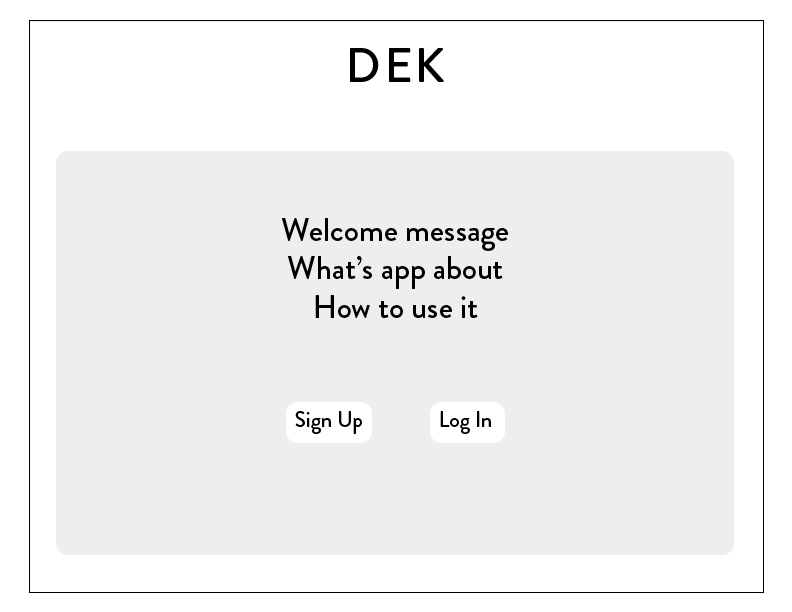

### Register

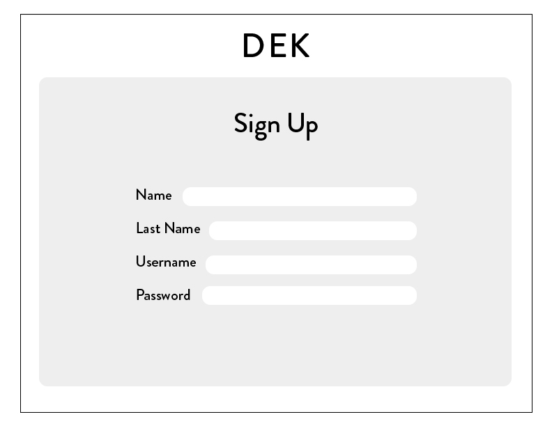

### Creating a New Flash Card

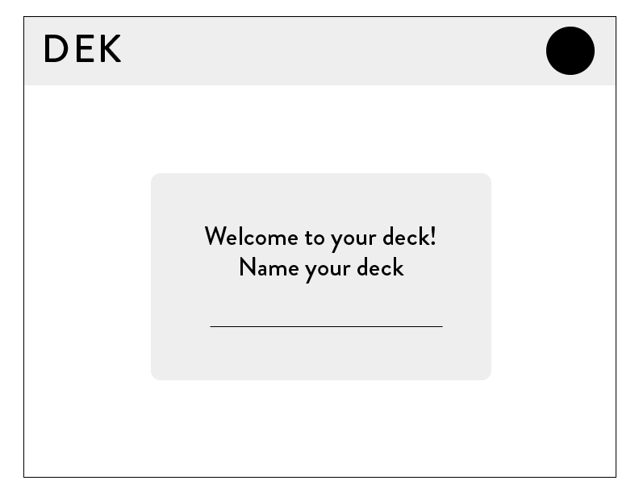
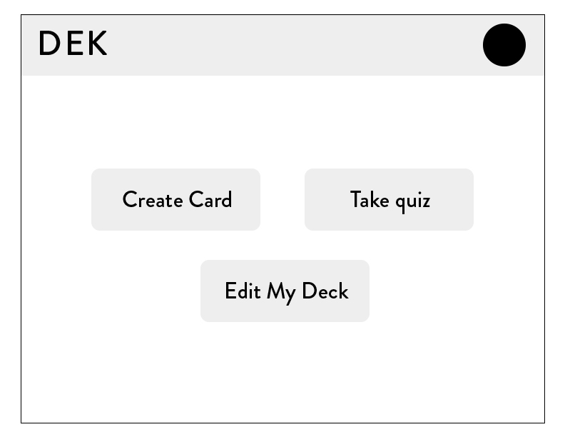
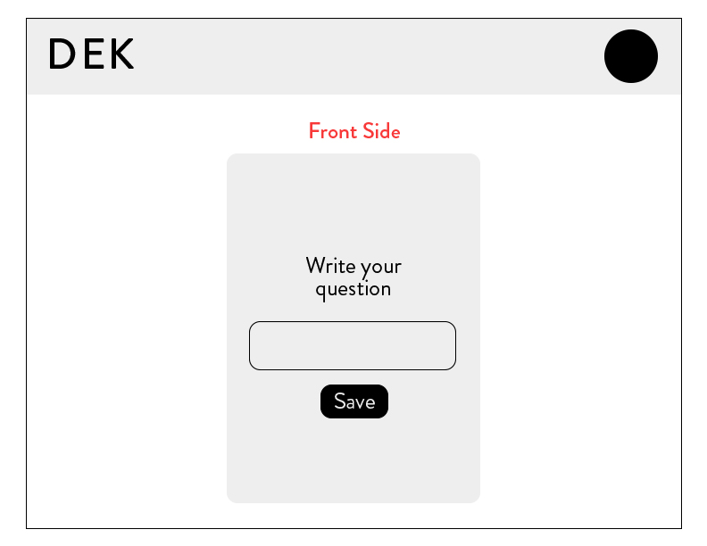
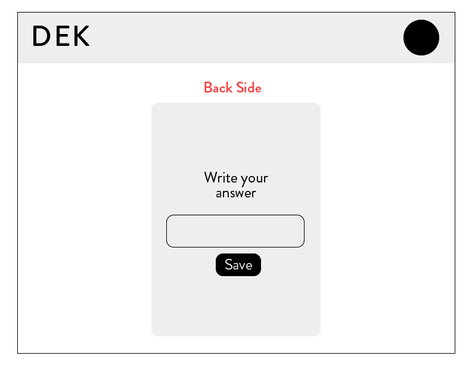

### Taking the Quiz

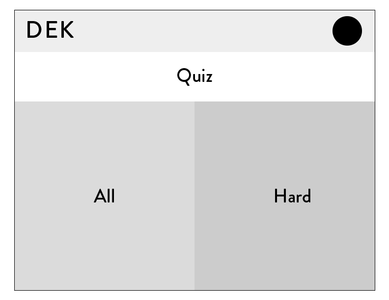

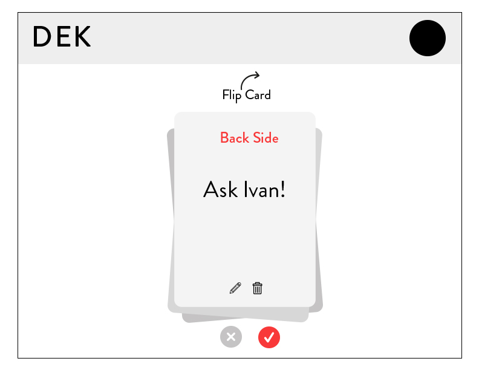
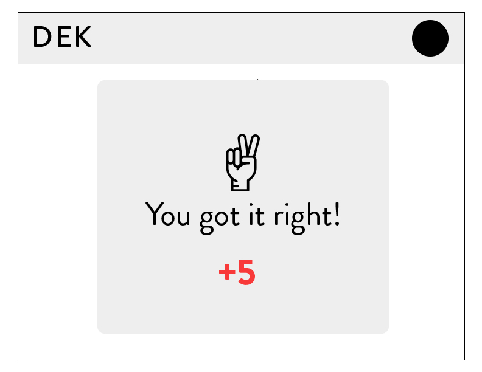
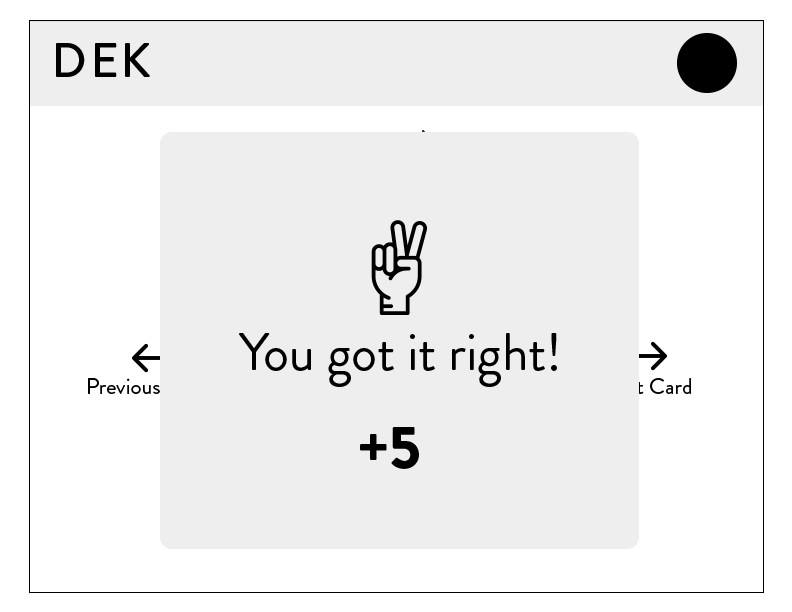
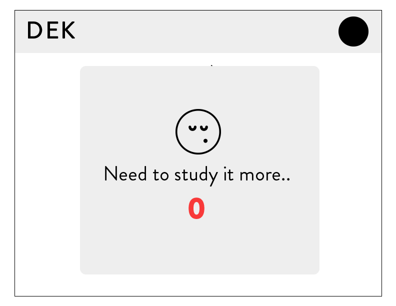
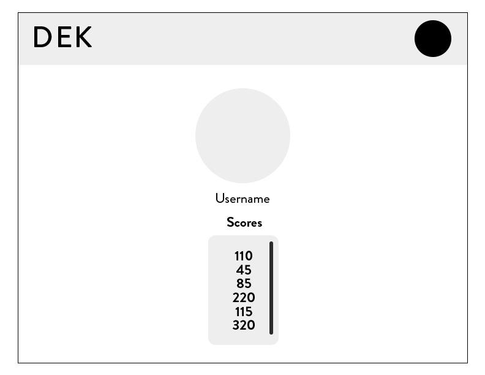

## Technology

The App will utilize the following technology

### React
The App will use React to create the front-end file structure.

### Express
[ADD DESCRIPTION]

### SQL
The approach of our card system will be sorting the user's cards into an array of database tables that each dictate a certain point of time in the future when the card should prompt again. Each card will have a tally coloumn that updates based on whether the user got the question right or wrong.

### Auth
[ADD DESCRIPTION]

## Phases of Completion

* Phase -3: Monday
    * Create basic file structure
    * Add Auth
    * Create database
    * Component for Main Menu
    * Component for Creating Flash Card
    * Basic CSS Style

* Phase -2: Tuesday
    * CSS animations for flash card review/flip
    * Components for reviewing all flash cards
    * Separate Component for reviewing only the hard flash cards
    * Complete basic app logic/functionality

* Phase -1: Wednesday
    * CSS Adapative or Reactive design for screen size
    * Finalize routing, ensure all components work together
    * Finalize design

* Phase 0 (MVP): Thursday
    * Identify any bugs
    * Fix bugs
    * Initial deployment of App

* Phase 1: Friday
    * Improvements to appearance
    * Add any additional features if sufficient time remaining

