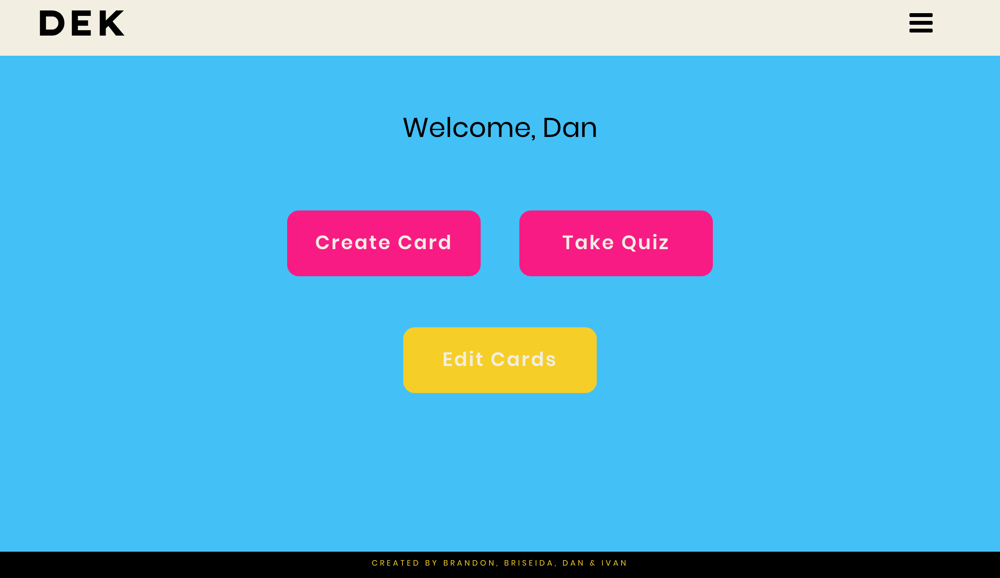
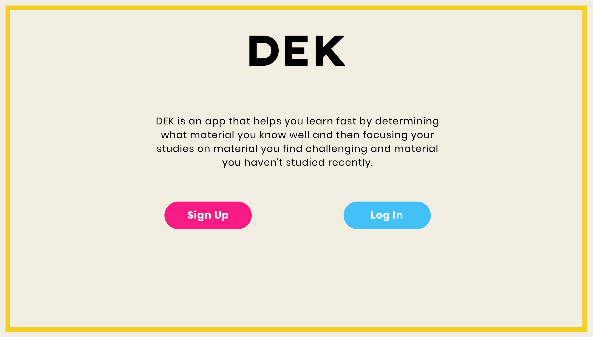

# Group Project 3

Team members: Brandon Hew, Briseida Montiel, Daniel Beebe, Ivan Alvarian

## User Story
'DEK' is an app which allows users to create their own unique stack of flash cards to aid in the learning process. This app can be used to learn a new language (foreign or programming) or any new subject which requires memorization.

When a new user visits the app, the first screen is a Welcome screen where the user can register to create a unique login. A registered user can simply login.

After loggging in, the user will be directed to the main menu. At the main menus, the user can choose to create a new flash card, review all flash cards, use a spaced-repetition method of review (see below). The user will also see a grand total score for how many cards the user got right during the user's flash card reviews.

A new user would want to begin by creating several flash cards. A button on the main menu would direc the user to a form where the create can create a front side (with a question or word) and a back side for each flash card. 

There will be 2 types of flach card reviews: (1) full review; and (2) spaced-repetition. A full-review quiz will review every card the user has created. The spaced-repetition quiz will review (1) cards the user got wrong the last time and (2) any cards the user has not reviewed recently (maybe 7 days; exact about of time yet to be determined).

When the user is reviewing flash cards, the user will view the front side of a flash card. When the user is ready, the user can click to view other side and check whether the user was right or wrong. The user clicks on 'right' or 'wrong' buttons to record whether the user got it right. If the card is 'wrong', that information is saved in the database and the card will be re-reviewed in the difficult set of cards. A card that is right would only be reviewed in a full review of all cards.

Each card can also be deleted, or edited and updated.

## Technologies
[ADD TEXT]

### Sample Code
[ADD CODE SNIPPETS]

## Making of the App
[ADD TEXT]

### Wireframes
[ADD IMAGES]

### Challenges
[ADD TEXT]

## Future Improvements
[ADD TEXT]

